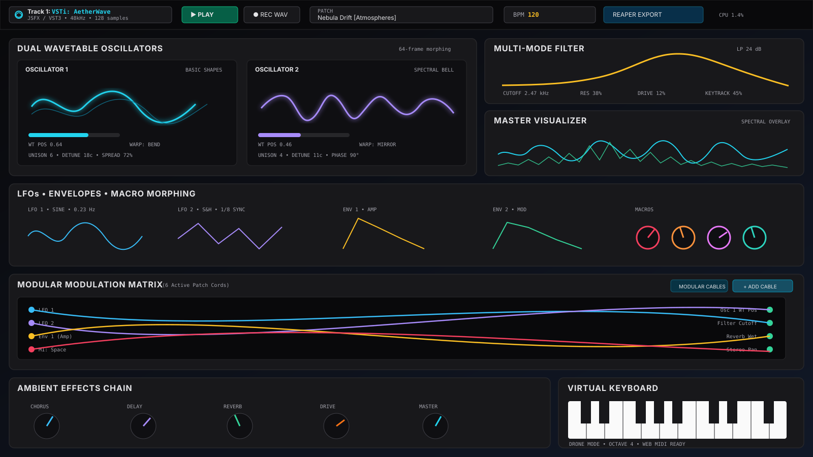
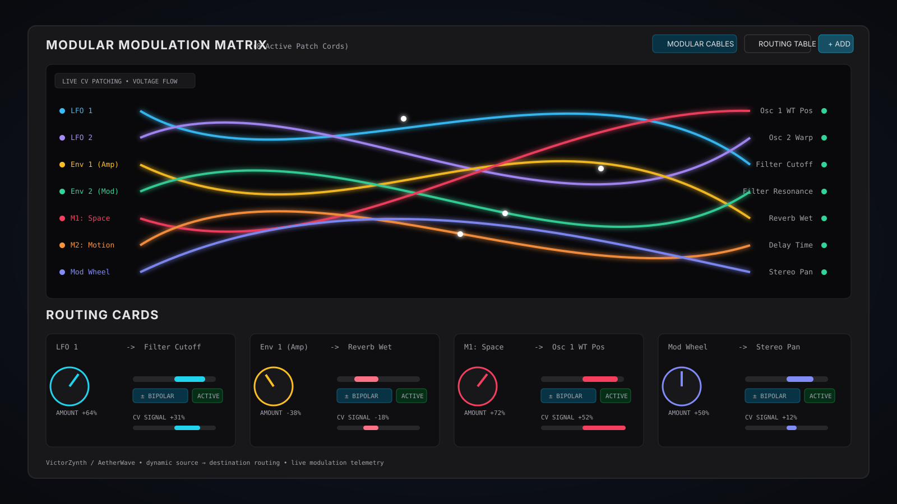
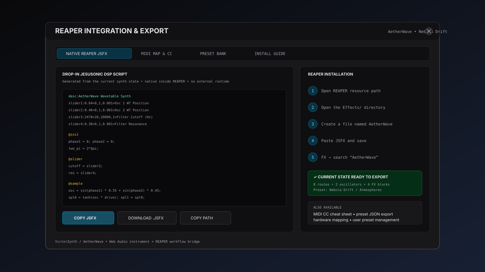
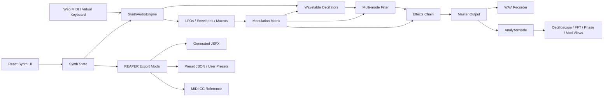

# VictorZynth — AetherWave Wavetable Synthesizer

<p align="center">
  <strong>A modular Web Audio wavetable synthesizer, modulation playground, soundscape engine, and REAPER workflow bridge.</strong>
</p>

<p align="center">
  React 19 · TypeScript · Vite · Web Audio API · Web MIDI · REAPER JSFX
</p>

<p align="center">
  
</p>

> **Project naming:** the repository is **VictorZynth** while the current instrument UI identifies the synth as **AetherWave**. The README uses both names where that distinction matters.

## What is VictorZynth?

VictorZynth is an experimental, browser-native synthesizer built for hands-on sound design rather than pretending a pile of sliders is a workflow.

The current instrument combines two morphable wavetable oscillators, sub/noise layers, a multi-mode filter, dual LFOs, dual envelopes, macro controls, an animated modulation matrix, a studio-style effects chain, real-time signal visualization, Web MIDI input, preset management, WAV recording, and a REAPER export surface.

The UI is intentionally closer to a hardware/modular instrument than a conventional web dashboard: modulation is visible, signal flow is explicit, and most of the synth can be explored without leaving the main workspace.

## Highlights

### Dual wavetable synthesis

- Two independent wavetable oscillators with frame morphing.
- Multiple waveform tables including basic, harmonic, vocal, metallic, digital, and ambient-oriented material.
- Warp modes such as Bend, Sync, PWM, Mirror, and Drive.
- Unison, detune, stereo spread, level, pitch, and continuous phase-offset control.
- Dedicated sub oscillator and multi-flavor noise generator.

### Multi-mode filter

- 24 dB/oct and 12 dB/oct low-pass modes.
- Band-pass, high-pass, comb, and notch responses.
- Cutoff, resonance, drive, and key tracking.
- Real-time filter response visualization.

### Modulation system

- Dual LFOs with free-running and tempo-oriented behavior.
- Dual ADSR envelopes.
- Four assignable macro controls.
- Sources including LFOs, envelopes, macros, mod wheel, velocity, key tracking, and chaos drift.
- Destinations spanning oscillator position/warp/pitch/level, filter parameters, FX mix, delay time, LFO rates, and stereo pan.
- Bipolar or unipolar routing depth.
- Live modulation telemetry.

<p align="center">
  
</p>

### Modular cable view

The modulation matrix has two ways to think about routing: a conventional routing-table view and a patch-cable view. The cable renderer draws animated source-to-destination connections and uses live modulation values to visualize signal activity.

This is one of the more interesting parts of the project because modulation stops being invisible state and becomes something you can actually inspect.

### Effects and output

- Stereo chorus / flanger style spatial processing.
- Ping-pong delay.
- Algorithmic reverb.
- Soft-clipping drive / saturation.
- Master output control.
- Live WAV recording from the browser audio engine.

### Visualizer engine

The visualizer can present several views of the current signal, including waveform, spectrum, combined spectral/time-domain information, stereo phase, and modulation-oriented telemetry.

### Presets and performance controls

- Factory preset library.
- Category filtering for Pads, Leads, Bass, FX, Atmospheres, Ambient Drones, Cinematic sounds, and user presets.
- Browser-local user preset storage.
- Virtual keyboard.
- Drone mode.
- USB / hardware controller support through the Web MIDI API.
- Mod wheel and pitch-bend input.

## REAPER integration

VictorZynth includes a dedicated REAPER integration/export modal for taking the current instrument state into a DAW-oriented workflow.

<p align="center">
  
</p>

The export surface currently covers:

- REAPER JSFX generation.
- Copy/download workflow for generated JSFX code.
- MIDI CC mapping references.
- Preset import/export helpers.
- User preset management.
- REAPER installation guidance.

### Important: Web instrument vs native VST3

The current repository is a **React/Web Audio synthesizer with REAPER JSFX export**. It does **not currently contain a native C++/JUCE build system that emits a `.vst3` binary**.

That distinction matters. The interface can model a VST-style instrument workflow and export native REAPER JSFX, but producing a real VST3/AU/CLAP plugin would require an additional host layer such as JUCE, iPlug2, DISTRHO, or another native plugin framework.

## Architecture



## Project structure

```text
VictorZynth/
├── public/
├── docs/
│   └── images/
│       ├── overview.svg
│       ├── modulation-matrix.svg
│       └── reaper-export.svg
├── src/
│   ├── audio/
│   │   ├── engine.ts
│   │   ├── presets.ts
│   │   └── wavetables.ts
│   ├── components/
│   │   ├── EffectsSection.tsx
│   │   ├── FilterSection.tsx
│   │   ├── Knob.tsx
│   │   ├── ModulationMatrix.tsx
│   │   ├── ModulationSection.tsx
│   │   ├── OscillatorSection.tsx
│   │   ├── PhaseOffsetDial.tsx
│   │   ├── ReaperExportModal.tsx
│   │   ├── ReaperHostBar.tsx
│   │   ├── VirtualKeyboard.tsx
│   │   ├── VisualizerSection.tsx
│   │   └── WavetableVisualizer.tsx
│   ├── types/
│   │   └── synth.ts
│   ├── App.tsx
│   ├── index.css
│   └── main.tsx
├── index.html
├── package.json
├── tsconfig.json
└── vite.config.ts
```

## Getting started

### Requirements

- Node.js 18+ recommended.
- npm.
- A modern browser with Web Audio support.
- A Chromium-based browser is the safest choice if you want Web MIDI hardware input.

### Install

```bash
git clone https://github.com/MKlolbullen/VictorZynth.git
cd VictorZynth
npm install
```

### Run the development server

```bash
npm run dev
```

Vite is configured to serve the project on:

```text
http://localhost:3000
```

### Production build

```bash
npm run build
```

### Type-check

```bash
npm run lint
```

The current `lint` script runs TypeScript with `--noEmit`.

## Using the synth

1. Start the development server and open the local application.
2. Click **Enable Audio Engine** or interact with the interface to initialize browser audio.
3. Load a preset or build a patch from the oscillators.
4. Shape the sound with the filter and effects chain.
5. Add modulation routes in the **Modular Modulation Matrix**.
6. Play from the virtual keyboard or connect a MIDI controller.
7. Use the visualizer to inspect the signal and modulation behavior.
8. Record the result to WAV or open the REAPER export modal.

## Using the generated JSFX in REAPER

1. Open **REAPER Integration & Export** in VictorZynth.
2. Generate/copy the JSFX script for the current state.
3. In REAPER, choose **Options → Show REAPER resource path in explorer/finder**.
4. Open the `Effects` directory.
5. Create an `AetherWave` JSFX file and paste the generated script.
6. Refresh REAPER's FX browser if necessary.
7. Add the JSFX to a track and map MIDI/automation parameters as needed.

## Technology

| Layer | Technology |
| --- | --- |
| UI | React 19 + TypeScript |
| Build tooling | Vite 6 |
| Styling | Tailwind CSS 4 + custom CSS |
| Audio | Web Audio API |
| MIDI | Web MIDI API |
| Motion / UI interaction | Motion |
| Icons | Lucide React |
| DAW bridge | Generated REAPER JSFX |
| Presets | TypeScript models + browser local storage |

## Current direction

The most valuable next step is to make the project choose one of two identities cleanly:

**A. Best-in-class web synth / REAPER companion** — lean hard into Web Audio, JSFX export, MIDI mapping, preset exchange, and a polished browser instrument.

**B. True native plugin** — add a native audio/plugin shell and compile the DSP/UI into VST3, CLAP, and optionally AU builds.

Trying to describe the current codebase as both at once muddies the architecture. The synth itself is already interesting enough that the packaging layer should be explicit rather than hand-waved.

## Contributing

Issues and pull requests are welcome. Useful areas for contributions include DSP correctness, performance profiling, wavetable tooling, modulation UX, preset design, REAPER export fidelity, accessibility, and a future native-plugin host layer.

---

<p align="center">
  <strong>VictorZynth / AetherWave</strong><br />
  Wavetables, cables, modulation, and an arguably unreasonable number of glowing cyan things.
</p>
