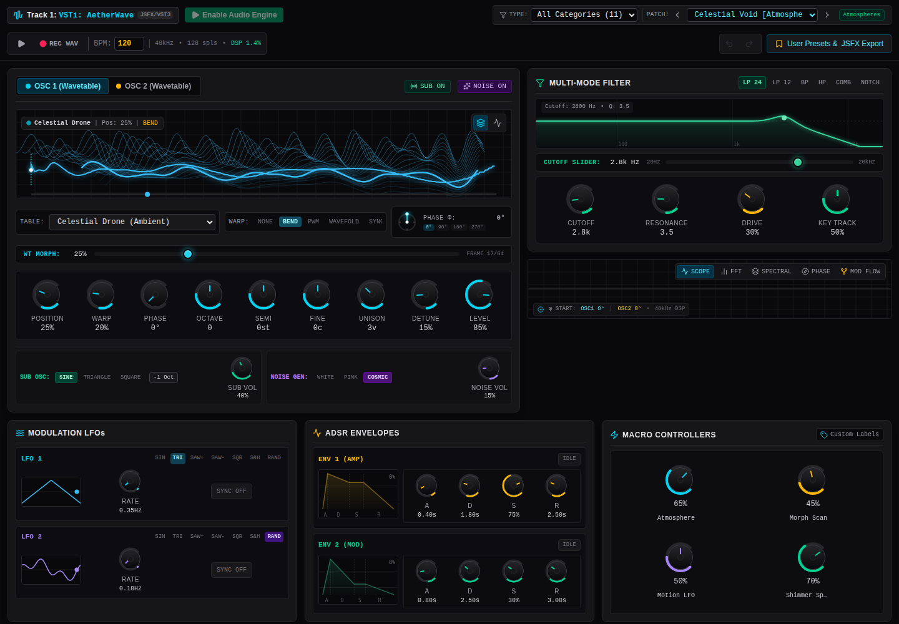
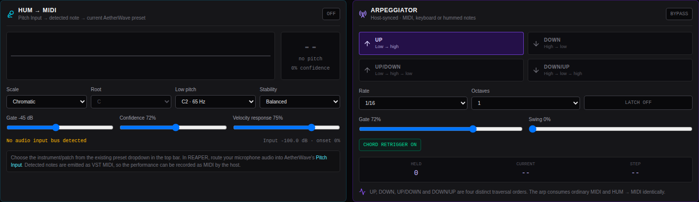
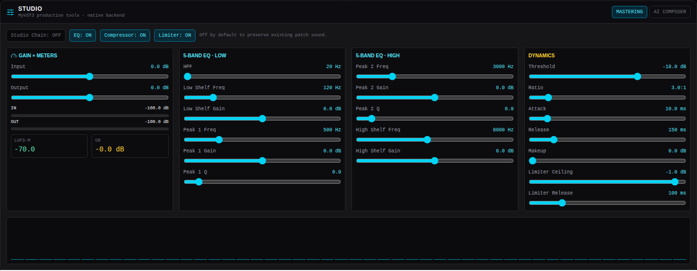
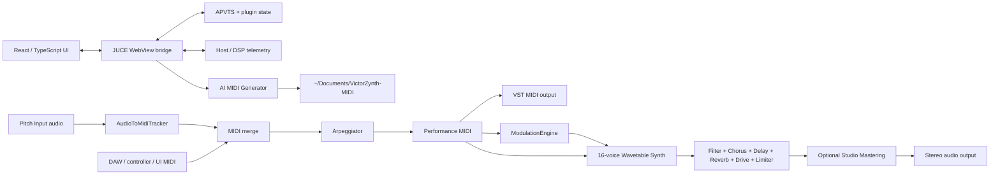

# VictorZynth — AetherWave

<p align="center">
  <strong>A native JUCE/VST3 wavetable synthesizer with an embedded React UI, HUM → MIDI performance input, four-way arpeggiator, mastering tools, modulation, effects, and AI-assisted MIDI composition.</strong>
</p>

<p align="center">
  <a href="https://github.com/MKlolbullen/VictorZynth/actions/workflows/native-vst3.yml"></a>
  
  
  
  
  
  
  
</p>

<p align="center">
  
</p>

> **Naming:** the repository is **VictorZynth**. The instrument/plugin presented to the host and in the UI is **AetherWave**.

**Linux download:** open a successful `main` run in [Native VST3 CI](https://github.com/MKlolbullen/VictorZynth/actions/workflows/native-vst3.yml?query=branch%3Amain), then download **AetherWave-linux-vst3** under Artifacts (GitHub sign-in required). The package includes the VST3, optional standalone app, checksums, source commit and installation instructions. The historical repository ZIP and release `v.0.1.7` predate the validated package; use a current CI artifact until a new release is published.

**Blank Linux editor in 0.4.0?** Version **0.4.1** fixes the WebKit response MIME type
that prevented the embedded page from loading. Upgrade the whole bundle using the
new package's installer with `--replace`. See [blank-editor diagnostics](docs/REAPER-Linux.md#blank-editor-or-basic-controls).

## What is AetherWave?

AetherWave is a real native software instrument: the audio path runs in C++/JUCE, the plugin builds as **VST3 + Standalone**, and the existing React interface is embedded inside the native plugin through a JUCE WebView bridge.

The project started as a browser/Web Audio wavetable synth and has since grown into a native instrument with 16-voice synthesis, modulation, effects, host automation/state, production/mastering tools, AI MIDI generation, microphone pitch-to-MIDI, MIDI output, and a tempo-synchronised arpeggiator.

The browser engine still exists as a useful development/preview runtime. Inside a DAW, however, audio generation and processing are native C++—the WebView is the interface, not the DSP engine.

## Current-build UI

These PNGs are generated from the current React interface by the repository's screenshot workflow rather than being hand-drawn mockups. Native-only panels are exposed during documentation capture with idle telemetry; in the plugin those same components receive live data from JUCE.

### HUM → MIDI + arpeggiator

<p align="center">
  
</p>

### Studio mastering

<p align="center">
  
</p>

## Signal path

```text
Mic / audio input ──► Pitch detector ──► MIDI ──┐
                                                │
DAW MIDI / virtual keyboard ────────────────────┤
                                                ▼
                                         Arpeggiator
                                                │
                                                ▼
                                      Performance MIDI
                                       ├──────────────► VST MIDI out / host recording
                                       │
                                       ▼
                               Modulation + Synthesiser
                                       │
                                       ▼
                              Chorus / Delay / Reverb
                                       │
                                       ▼
                               Drive / Master Limiter
                                       │
                                       ▼
                           Optional Studio Mastering
                                       │
                                       ▼
                                      Audio out
```

## Highlights

### Native wavetable synthesiser

- **16-voice polyphony** using JUCE `SynthesiserVoice` instances.
- Two wavetable oscillators per voice.
- Six native wavetable families:
  - Analog Warmth
  - Spectral Void
  - Celestial Drone
  - Vocal Formants
  - Cyber Wavefold
  - Metallic Bell
- Continuous wavetable position/morphing.
- Warp modes: **None, Sync, Bend, FM, Wavefold, PWM**.
- Unison up to 7 voices per oscillator with detune and stereo spread.
- Oscillator octave, semitone, fine tune, phase, pan and level controls.
- Dedicated sub oscillator and noise layer.
- Glide plus Poly / Mono / Legato performance modes.

### Filter + native effects

- Multi-mode filter with low-pass, band-pass, high-pass, notch and comb-style modes.
- Cutoff, resonance, key tracking and drive.
- Native stereo chorus.
- Ping-pong delay.
- Algorithmic reverb.
- Master drive/saturation.
- Output limiter.

### Modulation engine

The modulation system lives in the native processor and is shared with the UI through telemetry/state bridging.

Sources include:

- LFO 1 / LFO 2
- Envelope 1 / Envelope 2
- Macro 1–4
- Mod wheel
- Pitch bend
- Velocity
- Chaos/random modulation

Destinations include oscillator pitch/position/warp/phase/level, filter cutoff/resonance/drive, reverb mix, delay mix/time, chorus mix, LFO rates and pan.

The modulation matrix JSON is stored in plugin state, while live source/destination values are exposed to the React interface for visual feedback.

## HUM → MIDI

AetherWave can use an audio signal—typically a microphone—as a monophonic performance controller.

The native `Pitch Input` bus feeds a YIN-style pitch tracker which turns the detected fundamental into MIDI notes before the synth engine.

Features include:

- Real-time monophonic pitch detection.
- Input gate and confidence threshold.
- Configurable low/high pitch range.
- Pitch-stability/smoothing control.
- Velocity derived from input level.
- New-note/onset retrigger handling.
- Chromatic, Major and Minor scale snapping.
- Selectable root note for scale quantisation.
- Live waveform, detected note, frequency, confidence, onset and input-level telemetry.
- Generated MIDI is fed directly into the selected AetherWave patch.
- Generated MIDI is also emitted through the VST MIDI output so the DAW can record it.

In other words: **hum a line, let AetherWave detect it, play it through the current synth patch, and optionally record the resulting MIDI.**

## Four-way arpeggiator

The arpeggiator sits after incoming/detected MIDI, so it works with:

- DAW MIDI input
- the embedded virtual keyboard
- hardware/host MIDI
- HUM → MIDI notes

Traversal modes:

1. **Up** — low → high
2. **Down** — high → low
3. **Up / Down** — low → high → low
4. **Down / Up** — high → low → high

Additional controls:

- Host-tempo sync.
- 1/4, 1/8, 1/16 and 1/32 note rates.
- 1–4 octave expansion.
- Gate length.
- Swing.
- Latch.
- Chord retrigger.
- Sample-position-aware MIDI scheduling for clean intra-block timing.

## Studio mastering

The MyVST3 production layer was folded into AetherWave as a **backend/tooling layer**, not as a second plugin processor or a second native UI.

The optional Studio chain runs after the main synth/effects path and is **disabled by default** so older patches keep their sound.

It provides:

- Input and output trim.
- Five-band EQ:
  - high-pass
  - low shelf
  - parametric peak 1
  - parametric peak 2
  - high shelf
- Stereo-linked soft-knee compressor.
- Makeup gain.
- Brickwall limiter.
- Limiter ceiling/release controls.
- Gain-reduction telemetry.
- Input/output meters.
- Momentary LUFS monitoring.
- FFT/spectrum telemetry.

Studio parameters use stable APVTS IDs and are available to host automation/state.

## AI Composer + MIDI library

AetherWave also includes a background-thread MIDI composition/arrangement tool.

Supported workflows:

- Anthropic API.
- OpenAI-compatible endpoints.
- Local OpenAI-compatible model endpoints.
- Single MIDI clip generation.
- Multi-track arrangement generation.
- MIDI humanisation/parsing/writing.
- Recent MIDI library inside the plugin UI.

Generated files are written to:

```text
~/Documents/VictorZynth-MIDI
```

Provider/model/API-key settings are stored **machine-local** using JUCE application settings and are deliberately not stored inside the DAW/VST project state.

## React/WebView native UI

AetherWave keeps the React interface while using native C++ for the real plugin runtime:

```text
React 19 + TypeScript
        │
        ▼
JUCE WebView bridge
        │
        ├──► APVTS parameters / automation gestures
        ├──► MIDI note / pitch-bend / mod-wheel messages
        ├──► host transport + tempo + time signature
        ├──► modulation telemetry
        ├──► HUM → MIDI / arpeggiator state + telemetry
        ├──► Studio mastering telemetry
        └──► AI MIDI controls / library
        │
        ▼
Native JUCE processor + DSP
```

Release builds embed the production Vite bundle through JUCE `BinaryData`; the VST3 does **not** depend on `localhost`, a running Node server, or an external web directory.

## REAPER usage

### Install the plugin

After building, copy the generated `AetherWave.vst3` bundle into a VST3 location scanned by REAPER, then rescan plugins.

For CI downloads, unzip the GitHub artifact, verify `SHA256SUMS`, then extract
`AetherWave-linux-x86_64.tar.gz`. Close REAPER and run these commands inside the extracted directory:

```bash
python3 install-linux.py --check
python3 install-linux.py
```

The installer checks runtime libraries and installs the **whole** bundle in
`~/.vst3/`. To update, use `--replace`; the previous bundle is backed up outside
the scan directory. A loose `.so` or `Contents/` directory is not an installed bundle.
See [Linux installation, runtime dependencies and REAPER acceptance checks](docs/REAPER-Linux.md).

The Linux CI artifact is produced at:

```text
build/VictorZynth_artefacts/Release/VST3/AetherWave.vst3
```

### Normal MIDI instrument use

1. Insert **VST3i: AetherWave** on a track.
2. Route or record-arm MIDI as usual.
3. Pick a factory/user preset or create a patch.
4. Play from REAPER, a controller, or the embedded keyboard.
5. Automate native parameters from the DAW where desired.

### HUM → MIDI in REAPER

1. Put AetherWave on the destination instrument track.
2. Route your microphone/audio source into AetherWave's **Pitch Input** audio channels.
3. Open the **HUM → MIDI** panel and enable listening.
4. Set gate, pitch range, stability and scale/root as needed.
5. Select the synth patch you want to play from the normal preset selector.
6. Optionally enable the arpeggiator.
7. To capture generated MIDI, use REAPER's track recording mode for **Record: output (MIDI)** or route the plugin's MIDI output to another track.

The native processor accepts mono or stereo Pitch Input and always produces stereo audio output.

## Architecture



## Building

### Requirements

Core build requirements:

- CMake 3.22+
- C++20 compiler
- Ninja recommended
- Node.js 22 + npm
- JUCE 9.0.2 is fetched automatically by CMake

Linux also needs the JUCE audio/GUI/WebView development libraries. The authoritative package list lives in `.github/workflows/native-vst3.yml`.

### Clone

```bash
git clone https://github.com/MKlolbullen/VictorZynth.git
cd VictorZynth
```

### Build the native plugin

```bash
npm ci --no-audit --no-fund

cmake -S . -B build -G Ninja \
  -DCMAKE_BUILD_TYPE=Release \
  -DAETHERWAVE_WEB_DEV_SERVER=OFF \
  -DAETHERWAVE_BUILD_WEB_UI=ON

cmake --build build \
  --target VictorZynth_VST3 VictorZynth_Standalone \
  --parallel 2
```

Outputs:

```text
build/VictorZynth_artefacts/Release/VST3/AetherWave.vst3
build/VictorZynth_artefacts/Release/Standalone/AetherWave
```

### Browser/UI development

The original browser/Web Audio runtime remains useful for fast UI work:

```bash
npm ci
npm run dev
```

Then open:

```text
http://localhost:3000
```

Browser mode uses the Web Audio engine. Native-only Performance/Studio tools appear when the UI is running inside the JUCE host.

### Type-check

```bash
npm run lint
```

### Build only the embedded UI

```bash
npm run build -- --mode plugin
```

This writes the deterministic embedded assets expected by CMake under:

```text
plugin/WebUI/dist/
```

## Project structure

Native CI uses SHA-pinned Actions, JUCE and pluginval source, plus the committed
npm lockfile. A focused CMake patch sets the WebKit URI response content type in
the pinned JUCE 9.0.2 source. CI verifies that the production UI renders in real
WebKitGTK, then validates the Linux ELF, manifest, exports and runtime libraries;
packages the bundle with permissions intact; installs it using the shipped installer; tests MIDI-to-audio, layouts,
sample rates, restart and state recall in a native VST3 host; then runs pluginval
at strictness 5 including editor tests under Xvfb. The actual installed VST3 and
standalone must also render React controls, CSS and canvases and complete a native
parameter round-trip. VST3 editor reopen/resize and screenshots are included.
Packages are uploaded only if
all gates pass. This does not claim compatibility with older Linux ABIs or replace
an actual REAPER playback/project-reopen test. Ubuntu packages and Node 22 patch
versions still receive updates; this is dependency-locked, not a bit-for-bit build.

To prepare a release, run **Native VST3 CI → Run workflow** on the intended commit's
branch and enable **Prepare a draft release**. After every native gate passes, a
separate job creates a draft prerelease named for the compiled version and attaches
the exact validated archive, checksum and provenance. A `v0.4.0`-style tag push also
prepares a draft; its version must match the plugin. Existing releases are never
overwritten. See [release preparation and REAPER acceptance](docs/Releasing.md).

Local regression tests (no audio hardware required):

```bash
node --import tsx --test tests/bridge.test.ts
python3 -m unittest discover -s tests -p 'test_*.py' -v
```

To enable the native host smoke test, configure with `-DAETHERWAVE_BUILD_TESTS=ON`,
build `AetherWaveSmoke`, and run `xvfb-run -a ctest --test-dir build --output-on-failure`.

```text
VictorZynth/
├── .github/workflows/
│   ├── native-vst3.yml
│   └── capture-readme-screenshots.yml
├── docs/images/
│   ├── runtime-overview.png
│   ├── runtime-performance.png
│   ├── runtime-studio.png
│   └── *.svg
├── plugin/
│   ├── AI/
│   │   └── MidiGenerator.*
│   ├── DSP/
│   │   ├── Arpeggiator.*
│   │   ├── AudioToMidiTracker.*
│   │   ├── EffectsChain.*
│   │   ├── MasteringChain.*
│   │   ├── ModulationEngine.*
│   │   ├── WavetableBank.*
│   │   └── WavetableVoice.*
│   ├── Parameters/
│   │   └── Parameters.*
│   ├── Source/
│   │   ├── PluginEditor.*
│   │   └── PluginProcessor.*
│   └── WebUI/dist/              # generated embedded React bundle
├── src/
│   ├── audio/
│   │   ├── engine.ts            # browser/Web Audio runtime
│   │   ├── runtime.ts           # browser/native runtime facade
│   │   ├── presets.ts
│   │   └── wavetables.ts
│   ├── components/
│   │   ├── PerformanceToolsSection.tsx
│   │   ├── StudioToolsSection.tsx
│   │   ├── ModulationMatrix.tsx
│   │   ├── EffectsSection.tsx
│   │   └── ...
│   ├── native/
│   │   └── bridge.ts
│   ├── types/
│   └── App.tsx
├── CMakeLists.txt
├── package.json
└── vite.config.ts
```

## Native state and realtime design

A few architectural rules are deliberate:

- **Audio stays native.** React/WebView never performs plugin DSP.
- **The audio callback does not make AI/network requests.** MIDI generation runs on a background thread.
- **Stable parameter IDs matter.** Existing IDs such as `master.volume` are preserved for automation compatibility.
- **Normal UI edits are incremental.** They do not overwrite unrelated DAW-automated parameters.
- **Modulation/performance state is persisted with the plugin.**
- **API credentials are not VST project state.** They remain machine-local.
- **Studio mastering is opt-in.** Existing patches are not silently remastered.

## CI

`Native VST3 CI` validates the complete Linux build path:

- frontend dependency install
- TypeScript type-check
- production plugin UI build
- JUCE/Linux dependency setup
- CMake configure
- VST3 build
- Standalone build
- VST3 artifact verification
- artifact upload

The workflow uses pinned GitHub Action SHAs and runs on Ubuntu 24.04.

## Status

AetherWave is an actively developed experimental instrument. The native VST3 pipeline is functional and CI-built; the next stage is increasingly about **runtime/DAW validation, DSP refinement, portability and musical feel** rather than proving that the plugin shell exists.

Useful next areas include:

- Windows/macOS CI and packaging.
- pluginval validation.
- deeper REAPER routing/automation tests.
- improved wavetable anti-aliasing/oversampling.
- pitch-tracker tuning against real voice/instrument recordings.
- additional arp patterns and clock options.
- Tap Pattern / Sample Shaper ports from the MyVST3 donor project.
- OS keychain-backed AI credential storage.

## Contributing

Issues and pull requests are welcome. DSP correctness, plugin-host compatibility, realtime safety, UI/UX, preset design, testing and platform packaging are especially useful areas.

---

<p align="center">
  <strong>VictorZynth / AetherWave</strong><br />
  Native wavetables, modulation cables, hum-driven MIDI, and—yes—still an arguably unreasonable amount of cyan.
</p>
